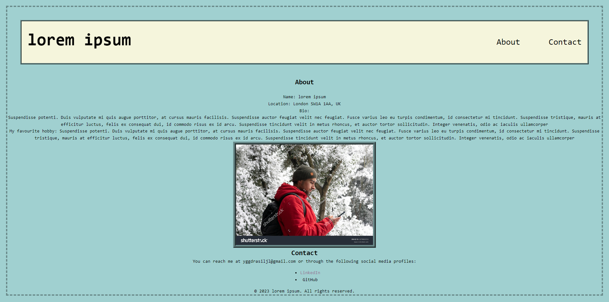
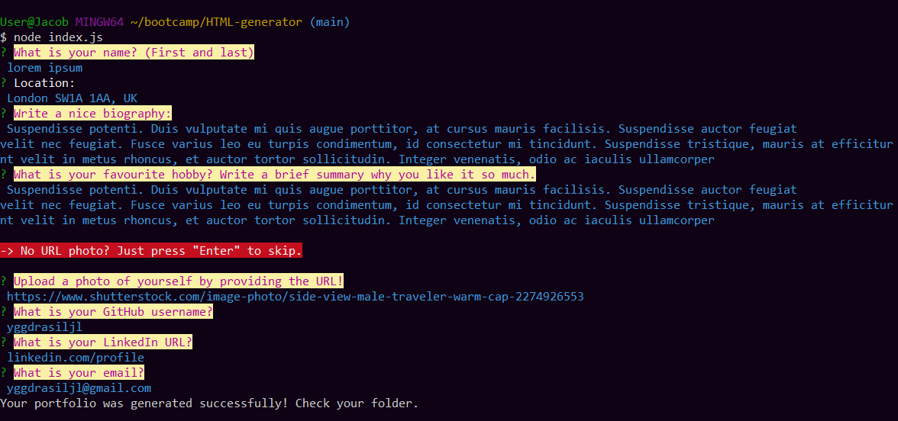

# Portfolio HTML generator

# Description
This is a simple portfolio generator created using node, the user goes through a series of prompts to create a personalized portfolio that populates the page with the users inputs.

# Screenshots

# Usage
To use the Portfolio generator, run this command:

    npm index.js

# Credits

This project was created by Jacob Lowther.